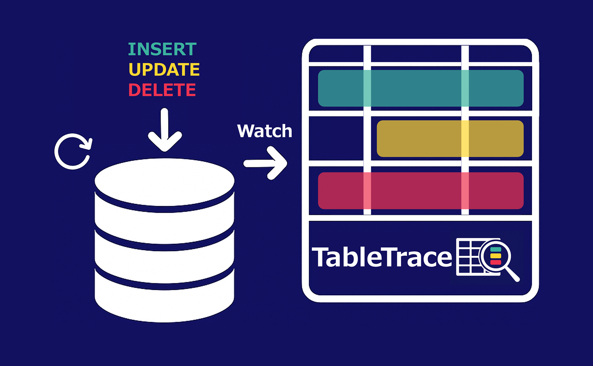

# TableTrace

[🇺🇸 English](./README.md)

データベースの変更をリアルタイムで可視化するデスクトップアプリケーション。

<p align="center">
  
</p>

## 機能

- **リアルタイム監視** - INSERT, UPDATE, DELETE 操作をリアルタイムで監視
- **マルチテーブル表示** - 複数のテーブルを同時に監視、色分けで変更を表示
- **イベントタイムライン** - 変更履歴を時系列で表示（相関グルーピング付き）
- **ERD 可視化** - インタラクティブな ER 図
  - ドラッグ＆ドロップでテーブル配置
  - 外部キーのリレーション線（カーディナリティ表記）
  - スキーマフィルタリング
  - ホバーでテーブル詳細表示
- **Dry Run モード** - SQL を安全にテスト（自動ロールバック、DBを変更せずに結果を確認）
- **変更のハイライト**
  - 緑: INSERT（新規行）
  - 黄: UPDATE（更新行）
  - 赤: DELETE（削除行）

## 対応データベース

- PostgreSQL（ローカル）
- Supabase（Docker 経由のローカル開発）

## クイックスタート（サンプル DB）

サンプル PostgreSQL で TableTrace を試せます：

```bash
# 1. サンプル DB を起動
docker compose -f demo/docker-compose.yml up -d

# 2. TableTrace を起動
npm run tauri dev

# 3. 以下の設定で接続:
#    Host: localhost
#    Port: 5432
#    Database: tabletrace_sample
#    User: postgres
#    Password: postgres
```

データベースの変更をテスト：

```bash
# INSERT
docker exec tabletrace-postgres psql -U postgres -d tabletrace_sample \
  -c "INSERT INTO users (name, email) VALUES ('Test User', 'test@example.com');"

# UPDATE
docker exec tabletrace-postgres psql -U postgres -d tabletrace_sample \
  -c "UPDATE products SET price = 39.99 WHERE id = 1;"

# DELETE
docker exec tabletrace-postgres psql -U postgres -d tabletrace_sample \
  -c "DELETE FROM users WHERE email = 'charlie@example.com';"
```

サンプル DB を停止：

```bash
docker compose -f demo/docker-compose.yml down -v
```

## インストール

### 必要な環境

- [Rust](https://rustup.rs/) (1.70+)
- [Node.js](https://nodejs.org/) (20.19+ または 22.12+)
- [Tauri CLI](https://tauri.app/start/prerequisites/)

### 開発

```bash
# リポジトリをクローン
git clone https://github.com/monorka/tabletrace-oss.git
cd tabletrace-oss

# 依存関係をインストール
npm install

# 開発モードで起動
npm run tauri dev
```

### ビルド

```bash
npm run tauri build
```

## 使い方

1. 「Connect」をクリックして PostgreSQL の接続情報を入力
2. サイドバーでテーブルをクリックして監視を開始
3. 変更がリアルタイムで色分け表示される
4. ERD タブでテーブル間のリレーションを可視化
5. Dry Run で SQL クエリを実行前にプレビュー

## 技術スタック

| レイヤー | 技術 |
|---------|------|
| フロントエンド | React 19, TypeScript, Tailwind CSS |
| バックエンド | Rust, Tauri 2 |
| データベース | PostgreSQL (tokio-postgres) |
| 可視化 | React Flow, Dagre |

## ライセンス

[AGPL-3.0](LICENSE)

## コントリビュート

プルリクエスト歓迎です。

## Pro 版（予定）

- Supabase Cloud 接続（Logical Replication）
- リアルタイム変更伝播の可視化
- エクスポート（PNG/SVG/PDF）
- 複数接続対応

